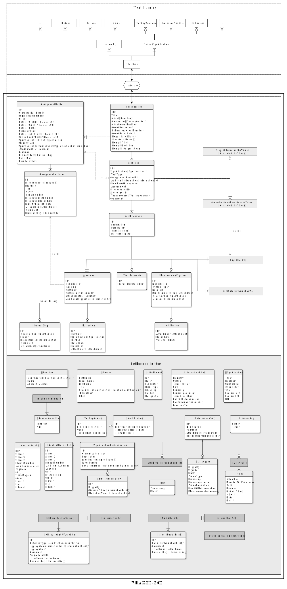

# VDA 231-301 JSON Schema

Welcome to the **VDA 231-301 JSON Schema Repository**, the official home for the JSON schema standard for the digital exchange of material test results. This repository is maintained as part of the VDA initiative to enable an open, collaborative standard that supports various industry needs.
Developed jointly by the German Association of the Automotive Industry (www.vda.de), as well as the Institute for Engineering Design and Industrial Design (IKTD) at the University of Stuttgart (www.iktd.uni-stuttgart.de) and many contributors from the automotive industry.

**DISCLAIMER**: We are constantly working to improve the VDA 231-301. If there are any differences between JSON schemas on GitHub and the published document by the VDA, the PDF on the VDA website is valid. 
The current version of the official VDA 231-301 document can be found in the VDA Webshop ([German](https://webshop.vda.de/VDA/de/vda-231-301-022025) / [English](https://webshop.vda.de/VDA/en/vda-231-301-022025)).

# JSON Schemas
The main goal of the VDA 231-301 JSON schema is to provide a standardized format for the digital exchange of material test results. The schema is designed to be generic and extensible, allowing for the representation of various test results across different standards. Of Scope of the schema is the exchange of target values.

The **generic schema** defines the basic structure of the data that all digital test reports should follow. 

Specific **sub-schemas** can be created for individual standards, further restricting the general format to ensure that test results for the same standard can always be exchanged in the same format.

### Download
 
**Generic schema**
- Schema: [VDA_231-301_Schema_Generic.json](./main/VDA_231-301_Schema_Generic.json)
- Version: 1.0.0

Currently, the following sub-schemas are available:
- **VDA 270** 
  - Title: "Determination of the odour characteristics of trim materials in motor vehicles" 
  - Schema: [VDA_231-301_Schema_VDA_270.json](https://github.com/VDA231-301/VDA_231-301__VDA_270/blob/main/VDA_231-301_Schema_VDA_270.json)
  - Example test report JSON: [VDA_231-301_Example_VDA_270.json](https://github.com/VDA231-301/VDA_231-301__VDA_270/blob/main/VDA_231-301_Example_VDA_270.json)
  - Standard source: https://webshop.vda.de/VDA/de/vda-270-052022
  - Version: 1.0.0
- **VDA 278** 
  - Title: "Thermal Desorption Analysis of Organic Emissions for the Characterization of Non-Metallic Materials for Automobiles"
  - Schema: [VDA_231-301_Schema_VDA_278.json](https://github.com/VDA231-301/VDA_231-301__VDA_278/blob/main/VDA_231-301_Schema_VDA_278.json)
  - Example test report JSON: [VDA_231-301_Example_VDA_278.json](https://github.com/VDA231-301/VDA_231-301__VDA_278/blob/main/VDA_231-301_Example_VDA_278.json)
  - Standard source: https://webshop.vda.de/VDA/de/vda-278-05-2016
  - Version: 1.0.0
- **SEP 1240**
  - Title: "Testing and Documentation Guideline for the Experimental Determination of Mechanical Properties of Steel Sheets for CAE-Calculations"
  - Schema: [VDA_231-301_Schema_SEP_1240_plasticity.json](./main/SEP_1240/VDA_231-301_Schema_SEP_1240_plasticity.json)
  - Example test report JSON: [VDA_231-301_Example_TensileTesting.json](./main/SEP_1240/VDA_231-301_Example_TensileTesting.json)
  - Standard source: https://matplus.shop/product/sep-1240?lang=en
  - Version: 1.0.0

# How to contribute

The VDA 231-301 JSON schemas are released under the MIT license, which allows everyone to use, modify, and distribute the schemas freely. However, if you want your contributions to become part of the official VDA recommendation, they need to go through the VDA 231-301 committee.

If you work for a VDA member, ask your contact person if you can join the working group. Everyone is free to raise issues or suggest new improvements to the protocol.

The process of releasing new specialised schemas is shown in the following diagram:

Contribution process diagram: [German](./assets/process%20flows/process_flow_release_of_new_specialised_schemas_DE.svg) / [English](./assets/process%20flows/process_flow_release_of_new_specialised_schemas_EN.svg)

## Goals

The VDA 231-301 standard defines a generic and extensible data model for representing test results in a digital, machine-readable format. Its goals include:

- **Interoperability:** Ensure seamless data exchange across OEMs, suppliers, laboratories, and vendors.
- **Flexibility:** Allow specific norms and test protocols to define their extensions through sub-schemas.
- **Validation:** Provide a robust framework for validating test data using the JSON Schema format.

The schema and its sub-schemas are versioned and collaboratively developed here on GitHub, ensuring a transparent and open improvement process.
## Getting Started

## VDA 231-301 recommendation
The latest version of the VDA 231-301 recommendation can be found on the VDA Webshop ([German](https://webshop.vda.de/VDA/de/vda-231-301-022025) / [English](https://webshop.vda.de/VDA/de/vda-231-301-022025)).

### Using the Schema

You can use the schema to:
- Validate your material test data.
- Integrate it into existing software tools.
- Develop converters, editors, or validators for the standard.

### Entity relationship diagram

