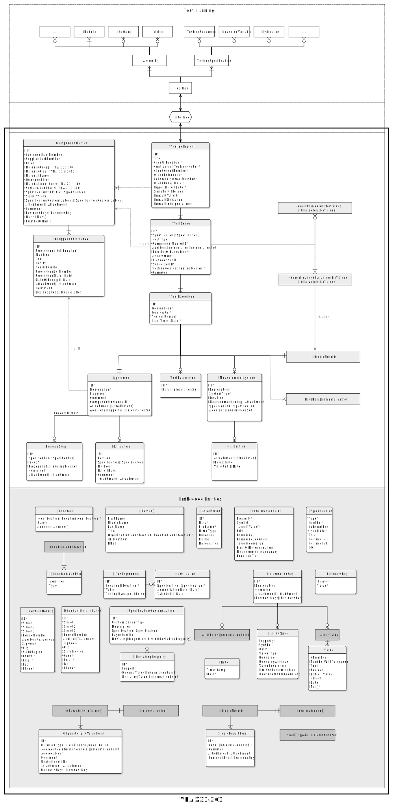

# VDA 231‑301 – Generic Schema

## Purpose and Scope

The Generic Schema defines the core semantic and structural elements of the VDA 231‑301 data model.  
It provides a stable, reusable foundation for the standardized exchange of material‑related data and ensures consistency, interoperability and traceability across different use cases and systems.

---


## Role of the Generic Schema within VDA 231‑301

Within the modular architecture of VDA 231‑301, the Generic Schema represents the central core layer.

It contains common concepts, structures and design principles that are shared across all subschemas.  
Domain‑specific, regulatory or process‑specific aspects are intentionally not defined here, but are implemented in dedicated subschemas that extend the Generic Schema.

The Generic Schema is designed to remain stable over time and to minimize breaking changes.

---

## How to Use the Generic Schema

The Generic Schema can be used to:
- understand the core concepts of the VDA 231‑301 data model  
- implement compatible data structures in IT systems  
- develop or extend subschemas  
- validate consistency of material‑related data exchanges  

It is intended as a reference for OEMs, suppliers, laboratories, software providers and other stakeholders.

---

## Conceptual Data Model

The VDA 231‑301 Generic Schema is based on a conceptual data model that separates semantic meaning from technical representation.

Key principles include:
- clear definition of objects and attributes  
- explicit relationships between data elements  
- support for traceability and referenceability  
- independence from specific IT implementations  

The conceptual design was developed in collaboration with the academic partner: Institute for Engineering Design and Industrial Design (IKTD), University of Stuttgart.


### Entity relationship diagram



---

## Structure and Core Elements

The Generic Schema defines essential building blocks that are reused consistently across all subschemas.

Typical core elements include:
- identifiers and references  
- metadata and contextual information  
- generic object structures  
- patterns for extensibility and specialization  

These elements form the structural backbone for all material‑related data exchanged using VDA 231‑301.

---

## JSON Representation and Design Principles

The VDA 231‑301 data model is represented using JSON.

The Generic Schema follows defined design principles, including:
- machine readability  
- consistency and clarity  
- extensibility without schema duplication  
- suitability for automated processing and validation  

The JSON‑based representation enables seamless integration into digital workflows, IT systems and data pipelines across organizational boundaries.

---

## Relationship to Subschemata

Subschemata extend the Generic Schema with specialized content depending on the standard.

Each subschema:
- builds upon the structures defined in the Generic Schema  
- adds domain‑, process‑ or regulation‑specific attributes  
- must comply with the core definitions and design principles of the Generic Schema  

This approach ensures a consistent overall data model while allowing flexibility for different application contexts.

---

## Versioning and Compatibility

The Generic Schema follows a controlled versioning approach.

Changes are managed with the goal to:
- preserve backward compatibility where possible  
- ensure transparency of structural and semantic changes  
- provide a reliable reference for subschema development and implementation  

Versioning information is documented within the repository.

---

## Governance and Standardization Context

The Generic Schema is part of the VDA 231‑301 recommendation and is developed and maintained within the VDA standardization framework.

Its evolution is coordinated through dedicated VDA project groups and aligned with industry requirements, regulatory developments and practical implementation experience.

---


## Contribution and Further Development

Contributions, feedback and improvement proposals are welcome and should follow the contribution guidelines defined in the VDA 231‑301 repositories. The repository follows the organization-wide contribution and governance rules: https://github.com/VDA231-301/.github/blob/main/CONTRIBUTING.md

The Generic Schema is continuously reviewed and further developed within the VDA context.


⚠️ **Important notice**

We are constantly working to improve the VDA 231‑301 recommendation. The **current official version** of the VDA 231‑301 document is published exclusively by the VDA and is available via the **VDA Webshop**  (**German / English**). The official document contains **additional information** that is **not part of this GitHub repository**.

The current version of the official VDA 231-301 document can be found in the VDA Webshop ([German](https://webshop.vda.de/VDA/de/vda-231-301-022025) / [English](https://webshop.vda.de/VDA/en/vda-231-301-022025)). It contains additional information about the recommendation that is not part of this repository. 

This repository contains the generic schema and tracks changes and issues. All official releases of the generic schema and the sub-schemas are available in the [schemas repository](https://github.com/VDA231-301/schemas).


---

## Language Requirement

English is the preferred language for all content.  
German content may be added where appropriate.

---


## Sub‑Schemas

Specific **sub-schemas** can be created for individual standards or recommendations, further restricting the general format to ensure that test results for the same standard can always be exchanged in the same format.


### 1. Creating New Sub‑Schemas

Guidelines for creating new sub‑schemas are available in:
- [English](https://github.com/VDA231-301/VDA231-301/blob/main/docs/guidelines_for_creating_subschemas_VDA231-301_en.md)
- [German](https://github.com/VDA231-301/VDA231-301/blob/main/docs/guidelines_for_creating_subschemas_VDA231-301_de.md)

---

### 2. General Information

This section describes the **subschema workflow repository** and the **lifecycle of subschemas** from conception to official publication.

#### Phase 1: Draft and Discussion (GitHub Repository)

Each subschema begins its lifecycle as an **independent GitHub repository**.

These repositories:
- serve as publicly accessible working drafts,
- invite discussion and collaborative development,
- collect feedback via GitHub Issues and Discussions.

Subschemas in this phase are **not yet officially versioned**.

#### Phase 2: Official Publication (Schema Repository)

Once a subschema has been reviewed and approved by the responsible **VDA Project Group (PG)**, it enters the official publication phase.

This includes:
- official versioning of the subschema,
- publication in the **central schema repository**,
- availability via a dedicated HTTPS endpoint.

✅ **Only subschemas published in the schema repository are considered officially released and versioned.**

---


### 3. Level of Detail for Standards

The level of detail in a subschema may vary:

- **Must**  
  Mandatory requirements according to the standard.
- **Can**  
  Optional requirements, often defined by internal factory standards.

The JSON Schema supports **both variants** and enables flexible implementation.

---

### 4. Versioning of Schemas

Each schema must have **clear versioning**.

- Semantic versioning is used (e.g. `v1.0.0`)
- Changes must be documented in a changelog
- Schema changes are made via **pull requests** only

This ensures **consistency, traceability, and transparency**.

---

### 5. Branching

All examples must:
- include the appropriate `if` condition to represent correct logic,
- ensure that `$ref` is present for references.

---

### 6. Using and Generating IDs

IDs must be **unique and stable**.They are generated They are generated using UUID v4. 

### Requirements

- Every referable object **MUST** carry an internal data ID in `_id`
- Type: `string`
- Format: **UUID v4** (RFC 4122)
- Representation: lowercase, hyphenated UUID  
  (e.g. `123e4567-e89b-12d3-a456-426655440000`)

### Stability and Uniqueness

- `_id` **MUST** be unique within a test report
- `_id` **MUST NOT** be mutated after assignment

### References

- Reference fields (e.g. `refId`, `instrumentRef`, `sampleRef`)
  **MUST** use the same type and format as `_id`

### Validation

- JSON Schema validates structure and format
- Referential integrity must be ensured via **build / CI checks**


### Reuse

The base schema provides `$defs` for `UuidV4` and `UuidV4Ref`. Subschemas include them via `$ref`.

**Example Base Schema Definition:**
```json
"$defs": {
  "UuidV4": {
    "type": "string",
    "format": "uuid",
    "pattern": "^[0-9a-f]{8}-[0-9a-f]{4}-4[0-9a-f]{3}-[89ab][0-9a-f]{3}-[0-9a-f]{12}$"
  }
}


{
  "_id": "123e4567-e89b-12d3-a456-426655440000",
  "instrumentRef": "987e6543-e21b-43d3-a456-426655440999"
}
```

---


### 7. Disclaimer on Standard Copyright

The content and references in this repository are based on standards whose copyrights belong to the respective standardization organizations  
(e.g. **DIN, ISO, VDA**).

⚠️ **Full standard texts must not be reproduced or published without permission.**  
Please ensure that you have the appropriate licenses when working with standard documents.

---
