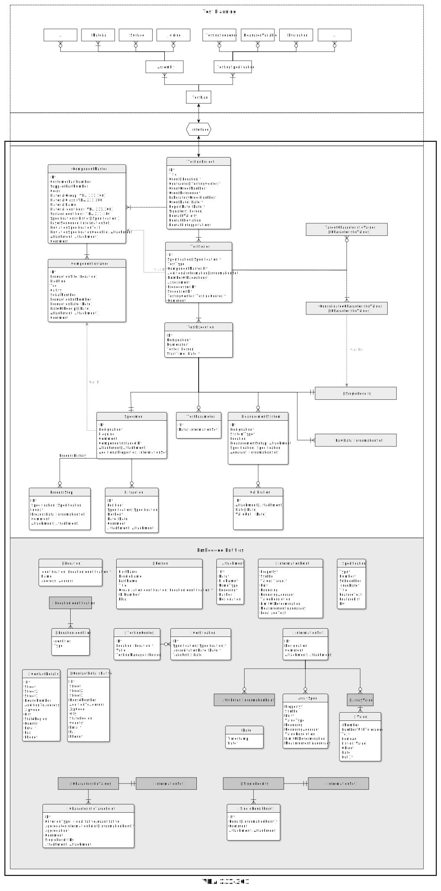

# VDA 231-301 JSON Schema

Welcome to the **VDA 231-301 JSON Schema Repository**, the official home for the JSON schema standard for the digital exchange of material test results. This repository is maintained as part of the VDA initiative to enable an open, collaborative standard that supports various industry needs.
Developed jointly by the German Association of the Automotive Industry (www.vda.de), as well as the Institute for Engineering Design and Industrial Design (IKTD) at the University of Stuttgart (www.iktd.uni-stuttgart.de) and many contributors from the automotive industry.

**DISCLAIMER**: We are constantly working to improve the VDA 231-301. 
The current version of the official VDA 231-301 document can be found in the VDA Webshop ([German](https://webshop.vda.de/VDA/de/vda-231-301-022025) / [English](https://webshop.vda.de/VDA/en/vda-231-301-022025)). It contains additional information about the standard that is not part of this repository. 

This repository contains the generic schema and tracks changes and issues. All official releases of the generic schema and the sub-schemas are available in the [schemas repository](https://github.com/VDA231-301/schemas).

# Getting Started

## Using the Schema

You can use the schema to:
- Validate your material test data.
- Integrate it into existing software tools.
- Develop converters, editors, or validators for the standard.

## Creating new sub-schemas
See the **guidelines  for creating sub-schemas**:
- [English](./docs/guidelines_for_creating_subschemas_VDA231-301_en.md)
- [German](./docs/guidelines_for_creating_subschemas_VDA231-301_de.md)

# Goals and Structure of the VDA 231-301 JSON Schema
The main goal of the VDA 231-301 JSON schema is to provide a standardized format for the digital exchange of material test results. The schema is designed to be generic and extensible, allowing for the representation of various test results across different standards. Of Scope of the schema is the exchange of target values.

The **generic schema** defines the basic structure of the data that all digital test reports should follow. 

Specific **sub-schemas** can be created for individual standards, further restricting the general format to ensure that test results for the same standard can always be exchanged in the same format.

### Schemas
 
**Generic schema**
- Repository: [VDA231-301](https://github.com/VDA231-301/VDA231-301) (this repository)
- Latest version: 1.0.0
- Downloads: [schemas repository](https://vda231-301.github.io/schemas/#/generic)

### Sub-schemas
Currently, the following sub-schemas are available:

- **EN 10204** 
  - Title: "Metallic products - Types of inspection documents" 
  - Repository: [VDA_231-301__EN_10204](https://github.com/VDA231-301/VDA_231-301__EN_10204)
  - Standard source: https://webshop.vda.de/VDA/de/vda-270-052022
  - Latest version: not released yet
- **VDA 270** 
  - Title: "Determination of the odour characteristics of trim materials in motor vehicles" 
  - Repository: [VDA_231-301__VDA_270](https://github.com/VDA231-301/VDA_231-301__VDA_270)
  - Standard source: https://webshop.vda.de/VDA/de/vda-270-052022
  - Latest version: not released yet
- **VDA 278** 
  - Title: "Thermal Desorption Analysis of Organic Emissions for the Characterization of Non-Metallic Materials for Automobiles"
  - Repository: [VDA_231-301__VDA_278](https://github.com/VDA231-301/VDA_231-301__VDA_278)
  - Standard source: https://webshop.vda.de/VDA/de/vda-278-05-2016
  - Latest version: not released yet
- **SEP 1240**
  - Title: "Testing and Documentation Guideline for the Experimental Determination of Mechanical Properties of Steel Sheets for CAE-Calculations"
  - Repository: [VDA_231-301__SEP_1240](https://github.com/VDA231-301/VDA_231-301__SEP_1240)
  - Standard source: https://matplus.shop/product/sep-1240?lang=en
  - Latest version: not released yet

# How to contribute

The VDA 231-301 JSON schemas are released under the MIT license, which allows everyone to use, modify, and distribute the schemas freely. However, if you want your contributions to become part of the official VDA recommendation, they need to go through the VDA 231-301 committee.

If you work for a VDA member, ask your contact person if you can join the working group. Everyone is free to raise issues or suggest new improvements to the protocol.
The responsible body for the development and maintenance of VDA 231-301 and VDA 231-300 is the VDA Project Group (PG) Digital Material Data Management in the Sampling Process – Implementation and Realization. This project group operates under the leadership of the VDA Materials Committee.

Further information on the VDA's organization and its expert groups can be found here:
VDA Expert Group Technical Regulations https://www.vda.de/de/der-vda/organisation/fachabteilungen/fahrzeugtechnologien-und-eco-systeme/fachgruppe-technische-vorschriften

The AP Freigabe (AP Release) serves as a technically contributing group, supporting the project group in its work.

The process of releasing new specialised schemas is shown in the following diagram:

Contribution process diagram: [German](./assets/process%20flows/process_flow_release_of_new_specialised_schemas_DE.svg) / [English](./assets/process%20flows/process_flow_release_of_new_specialised_schemas_EN.svg)

## Goals

The VDA 231-301 standard defines a generic and extensible data model for representing test results in a digital, machine-readable format. Its goals include:

- **Interoperability:** Ensure seamless data exchange across OEMs, suppliers, laboratories, and vendors.
- **Flexibility:** Allow specific norms and test protocols to define their extensions through sub-schemas.
- **Validation:** Provide a robust framework for validating test data using the JSON Schema format.

The schema and its sub-schemas are versioned and collaboratively developed here on GitHub, ensuring a transparent and open improvement process.

### Entity relationship diagram

